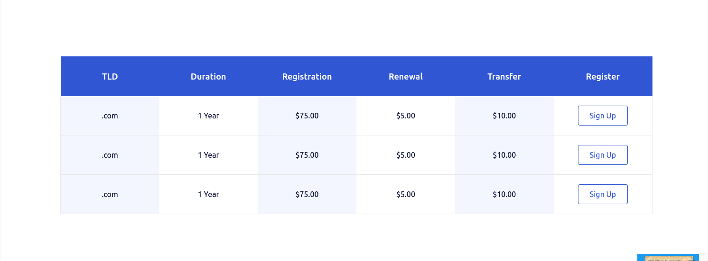
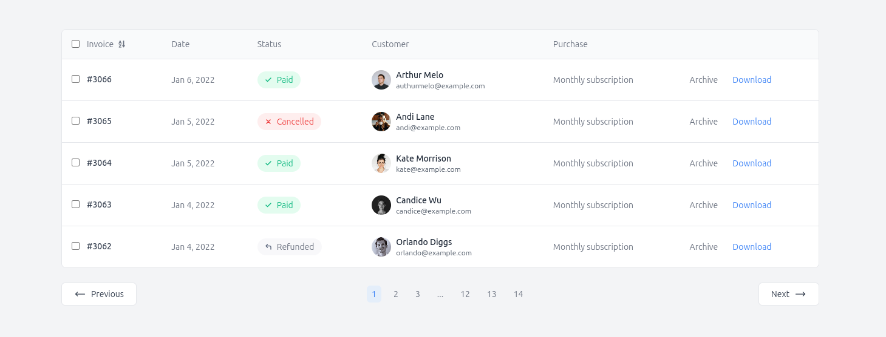

# PRODUCT CATALOG

// ...existing code...

## Installation Instructions

Description: This is an example project built with Laravel v11, Tailwind, and Livewire, featuring reactive pages for managing products and their categories.

## Tailwind Components Used

### Popup: The popup was designed to create and update products and categories.


### tailwind-css-tables: The table is used to show the categories.



### invoice-table-1: The table is used to show the products.



1. Clone the repository:
   ```sh
   git clone https://github.com/jonier/productcatalog.git
   ```

2. Navigate to the project directory:
   ```sh
   cd productcatalog
   ```
   ```

3. Start the development server:
   ```sh
   composer install & npm install
   ```
   ```

3. Install SQLite3. The application runs with SQLite3.


4. Run the migrations and seed the database:
   ```sh
   php artisan migrate:fresh --seed
   ```

5. Start the development server:
   ```sh
   composer run dev
   ```

6. Open your browser and register a new user:
    [http://127.0.0.1:8000/register](http://127.0.0.1:8000/register)
    

7. Sign in to the app
    [http://127.0.0.1:8000/login](http://127.0.0.1:8000/login)

// ...existing code...
